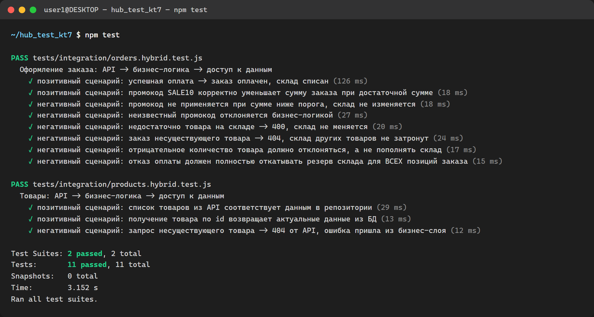

# bookstore-hybrid-testing-lab

Учебный REST API интернет-магазина книг (Node.js / Express), созданный как площадка для лабораторной работы по гибридному интеграционному тестированию. Ниже — полный отчёт по работе.

---

# Отчёт по лабораторной работе
## Тема: Освоение метода гибридного интеграционного тестирования на примере учебного проекта

**Дата:** 24.09.2026
**Проект:** `bookstore-hybrid-testing-lab` — учебный REST API интернет-магазина книг (Node.js / Express)

---

## 1. Цель и задачи

Цель работы — освоить метод **гибридного интеграционного тестирования**: сочетание нисходящего (top-down) и восходящего (bottom-up) подходов, при котором реальные модули приложения проверяются во взаимодействии друг с другом, а модули, не имеющие готовой реализации, заменяются заглушками (стабами) / моками.

Задачи, поставленные в рамках работы, и их выполнение:

| № | Задача | Статус |
|---|--------|--------|
| 1 | Выбрать проект | Выполнено — написан учебный проект «с нуля» специально под задачи лабораторной (см. п. 2) |
| 2 | Разработать тесты, охватывающие интерфейс, бизнес-логику и доступ к данным | Выполнено — 11 тестов в 2 наборах (см. п. 4) |
| 3 | Выполнить тестирование, зафиксировать проблемы, оценить эффективность подхода | Выполнено — найдено и исправлено 2 дефекта (см. п. 5) |
| 4 | Подготовить отчёт | Данный документ |

---

## 2. Выбор и архитектура проекта

Поскольку в рабочей директории не было готового проекта, для лабораторной был разработан небольшой, но архитектурно полноценный **учебный проект** — REST API интернет-магазина книг, намеренно спроектированный слоями, чтобы дать возможность проверять взаимодействие между ними:

```
src/
├── api/routes.js            — уровень интерфейса (HTTP API, Express)
├── services/
│   ├── orderService.js      — бизнес-логика оформления заказа (самый критичный сценарий)
│   └── productService.js    — бизнес-логика работы с товарами
├── data/
│   ├── productRepository.js — доступ к данным: товары
│   └── orderRepository.js   — доступ к данным: заказы
├── external/paymentGateway.js — внешний платёжный модуль (не имеет полной реализации, только "заглушка")
└── app.js                   — сборка приложения и обработка ошибок
```

Логика намеренно смоделирована так, чтобы один пользовательский сценарий (`POST /orders`) проходил через **все три уровня**: интерфейс принимает запрос → бизнес-логика проверяет остаток на складе, считает скидку и сумму → слой данных списывает товар со склада и сохраняет заказ → вызывается внешний платёжный модуль.

Модуль `paymentGateway.js` соответствует рекомендации задания: *"используйте моки или заглушки для модулей, которые ещё не завершены"* — в реальном проекте на его месте была бы интеграция со сторонним платёжным провайдером, которая на момент работы не реализована. В тестах он полностью подменяется (`jest.mock`), а все остальные слои — интерфейс, бизнес-логика, доступ к данным — работают в связке без подмены, что и делает тестирование **гибридным**, а не чисто модульным (unit) или чисто end-to-end.

Стек: **Express** (API), **Jest + Supertest** (тестирование).

---

## 3. Критичные сценарии, выбранные для тестирования

Согласно рекомендациям задания, в первую очередь были покрыты **самые критичные и часто используемые сценарии, затрагивающие несколько уровней**:

- Оформление заказа (`POST /orders`) — центральный бизнес-процесс: расчёт суммы, проверка остатка, применение скидки, резервирование и списание склада, вызов оплаты, откат при неудаче.
- Просмотр каталога товаров (`GET /products`, `GET /products/:id`) — проверка согласованности данных между интерфейсом и хранилищем.

Для каждого сценария разработаны **и позитивные, и негативные** тест-кейсы, как того требуют рекомендации.

---

## 4. Разработанные тесты

Файлы: `tests/integration/orders.hybrid.test.js`, `tests/integration/products.hybrid.test.js`

| Тест | Тип | Слои, задействованные "вживую" | Что проверяется |
|---|---|---|---|
| Список товаров соответствует репозиторию | позитивный | API → сервис → репозиторий | Данные из API совпадают с данными хранилища |
| Получение товара по id | позитивный | API → сервис → репозиторий | Корректная выдача одной записи |
| Запрос несуществующего товара | негативный | API → сервис | 404 и текст ошибки, сгенерированной бизнес-слоем |
| Успешная оплата заказа | позитивный | API → бизнес-логика → репозитории; оплата замокана (успех) | Заказ переходит в статус `paid`, склад списан на верную величину, `paymentGateway.charge` вызван с правильной суммой |
| Промокод SALE10 при сумме выше порога | позитивный | API → бизнес-логика → репозитории | Скидка 10% верно вычислена и передана дальше по цепочке (до вызова оплаты) |
| Промокод при сумме ниже порога | негативный | API → бизнес-логика → репозиторий | 400, склад **не изменяется**, оплата не вызывается |
| Неизвестный промокод | негативный | API → бизнес-логика | 400 с понятным сообщением |
| Недостаточно товара на складе | негативный | API → бизнес-логика → репозиторий | 400, склад не изменяется, оплата не вызывается |
| Заказ несуществующего товара | негативный | API → бизнес-логика | 404, оплата не вызывается |
| Отрицательное количество товара | негативный | API → бизнес-логика → репозиторий | Заказ должен быть отклонён, а не увеличивать остаток на складе |
| Отказ оплаты для заказа из нескольких позиций | негативный | API → бизнес-логика → репозитории; оплата замокана (отказ) | Откат (rollback) резерва склада должен произойти **для каждой позиции заказа**, а не только для первой |

Мокирование (`jest.mock('../../src/external/paymentGateway')`) применяется точечно — только к незавершённому внешнему модулю, что позволило детерминированно управлять сценариями "оплата прошла" / "оплата не прошла" без завязки на реальную интеграцию и без замедления тестов.

---

## 5. Ход тестирования и выявленные проблемы

### Первый запуск (`npx jest --runInBand`)

Результат: **2 из 11 тестов упали**, 2 набора: 1 упавший, 1 успешный.

#### Дефект №1 — отсутствие валидации количества товара

Тест «отрицательное количество товара должно отклоняться» ожидал `400`, но получил **`500 Internal Server Error`**:

```
TypeError: Cannot read properties of undefined (reading 'success')
    at orderService.js:71:16
```

**Причина:** `orderService.createOrder` не проверял, что `qty` — положительное целое число. При `qty = -2` условие проверки остатка (`product.stock < qty`) с отрицательным `qty` всегда ложно, поэтому заказ проходил дальше, а `productRepository.decreaseStock(id, -2)` **увеличивало** остаток на складе вместо уменьшения. В данном тестовом сценарии это дополнительно приводило к падению с 500-й ошибкой ниже по цепочке (при обращении к замоканному `paymentGateway.charge`, для которого в этом тесте не был задан возврат) — то есть один и тот же непроверенный вход давал два наложенных друг на друга дефекта: некорректную бизнес-логику (мог "пополнять" склад отрицательным заказом) и не обработанный причинный код ответа (500 вместо 400).

**Почему нашёл именно гибридный тест, а не изолированный unit-тест сервиса:** ошибка проявляется только при прохождении запроса через реальный HTTP-слой с реальным сериализатором ошибок (`app.js`) — то есть видна разница между "бизнес-логика бросила ожидаемую ValidationError" и "бизнес-логика упала с непойманным исключением", что напрямую сказывается на коде ответа API.

**Исправление** (`src/services/orderService.js`):
```js
if (!Number.isInteger(qty) || qty <= 0) {
  throw new ValidationError('Количество товара должно быть положительным целым числом');
}
```

#### Дефект №2 — некорректный откат резерва склада при отказе оплаты (баг копирования переменной)

Тест «отказ оплаты должен полностью откатывать резерв склада для ВСЕХ позиций заказа» (заказ из 2 разных товаров, оплата отклонена) ожидал возврат склада к исходным значениям, но:

```
Expected: 5   (остаток товара №1 до отката)
Received: 6   (после "отката" стало БОЛЬШЕ исходного)
```

**Причина:** в коде отката использовалась ошибочная переменная:

```js
// было:
orderItems.forEach((item) => productRepository.increaseStock(items[0].productId, item.qty));
```

Вместо `item.productId` (товар текущей итерации) везде подставлялся `items[0].productId` — товар **первой** позиции заказа. В результате при заказе из нескольких товаров склад **первого** товара восстанавливался несколько раз (переполнялся), а склад остальных товаров **не восстанавливался вовсе** — то есть при каждом отказе оплаты по многопозиционному заказу магазин "терял" реальный товар на складе безвозвратно, а по первому товару в заказе, наоборот, накапливал фиктивный излишек.

**Почему нашёл именно гибридный, а не поверхностный тест:** дефект **не проявляется** на заказе из одной позиции (там `items[0]` случайно совпадает с единственным элементом) и **не проявляется**, если репозиторий склада замокан в unit-тесте сервиса (мок просто зафиксирует вызов с неверным id, но без реального состояния "потери" товара это не будет выглядеть как ошибка). Дефект стал виден только тогда, когда тест прогонял запрос **через реальный API, реальную бизнес-логику и реальное (пусть и in-memory) хранилище**, для заказа из нескольких позиций и с реалистичным негативным сценарием (отказ оплаты) — то есть ровно то, что даёт гибридный интеграционный подход.

**Исправление** (`src/services/orderService.js`):
```js
// стало:
orderItems.forEach((item) => productRepository.increaseStock(item.productId, item.qty));
```

### Повторный запуск после исправлений

```
PASS tests/integration/orders.hybrid.test.js
PASS tests/integration/products.hybrid.test.js

Test Suites: 2 passed, 2 total
Tests:       11 passed, 11 total
```

Все 11 тестов, включая позитивные и негативные сценарии на всех трёх уровнях, проходят успешно:



---

## 6. Оценка эффективности гибридного подхода

1. **Оба найденных дефекта — межуровневые по своей природе.** Ни один из них не был бы обнаружен при "тонком" мокировании соседних слоёв в изолированных unit-тестах: дефект №1 маскировался за код ответа, формируемый только на уровне API; дефект №2 проявлялся только в реальном состоянии хранилища при многопозиционном заказе — состоянии, которое в чисто модульном тесте с замоканным репозиторием просто не с чем было бы сравнить.
2. **Точечное мокирование только незавершённого модуля** (внешнего платёжного шлюза) не помешало обнаружить дефекты в реальном коде остальных слоёв и одновременно не потребовало поднимать реальную стороннюю интеграцию — тестирование не "тормозилось" ожиданием готовности внешнего сервиса, как и рекомендовано методическими указаниями.
3. **Негативные сценарии оказались основным источником находок.** Оба дефекта нашли себя в негативных ветках (некорректный ввод, отказ оплаты), что подтверждает рекомендацию задания уделять равное внимание позитивным и негативным кейсам.
4. **Ограничение метода:** гибридные тесты медленнее и "тяжелее" чистых unit-тестов (поднимают Express-приложение, проходят через несколько модулей), а при падении требуют больше усилий на локализацию причины (нужно смотреть по всей цепочке вызовов, а не в одном модуле) — в данной работе это компенсировалось небольшим размером проекта.

**Вывод:** на примере учебного проекта гибридное интеграционное тестирование подтвердило свою эффективность именно там, где чистое модульное тестирование бессильно — на стыках между уровнями приложения (API ↔ бизнес-логика ↔ данные), при этом за счёт точечного стабирования недоделанного внешнего модуля процесс тестирования не был замедлен ожиданием готовности внешней интеграции.

---

## Приложение: как воспроизвести

```bash
npm install
npm test
```
